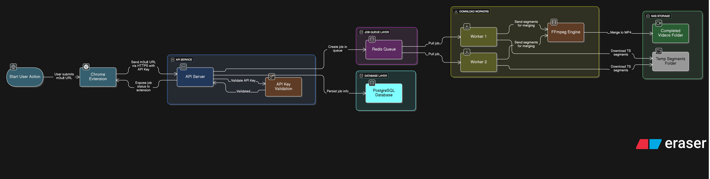
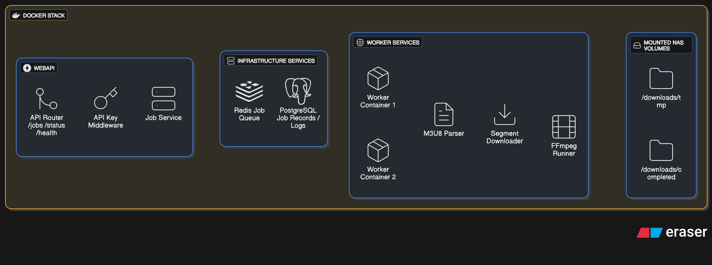
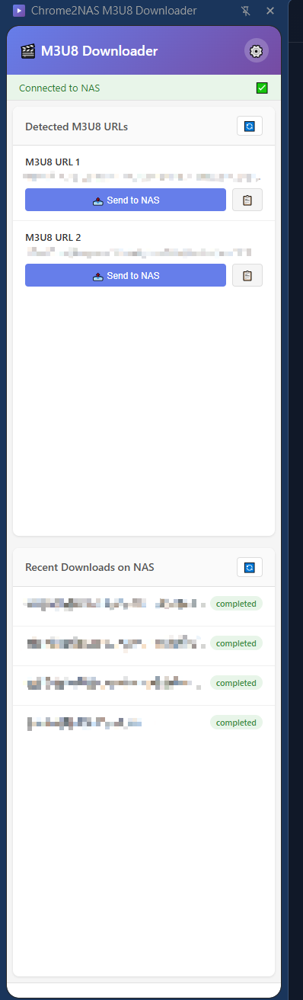

# Chrome2NAS M3U8 Downloader

[](https://opensource.org/licenses/MIT)
[](https://docs.docker.com/compose/)
[](https://www.python.org/)
[](https://developer.chrome.com/docs/extensions/)
[](https://github.com/asdfghj1237890/chrome2nas-m3u8/releases/latest)

> Seamlessly capture M3U8 and MP4 video streams from Chrome and download them to your NAS

## Table of Contents

- [Overview](#overview)
- [Quick Links](#quick-links)
- [Key Features](#key-features)
- [Technology Stack](#technology-stack)
- [Project Structure](#project-structure)
- [Requirements](#requirements)
- [Getting Started / Installation](#installation)
- [Usage](#usage)
- [Configuration](#configuration)
- [Security](#security)
- [Limitations](#limitations)
- [Troubleshooting](#troubleshooting)
- [Contributing](#contributing)
- [License](#license)
- [Documentation](#documentation)
- [Changelog](#changelog)
- [Support](#support)

## Overview

This system enables you to:
1. 🔍 Detect M3U8 and MP4 video URLs in Chrome
2. 📤 Send URLs to your NAS with one click
3. ⬇️ Automatically download and convert to MP4
4. 💾 Store videos on your NAS storage

## System Architecture

```
Chrome Extension → NAS Docker (API + Worker) → Video Storage
```



### Backend Architecture



## Quick Links


<p align="right"><sub>Chrome Extension Interface (Click to view full size)</sub></p>

- **[🚀 Installation Guide](#installation)** - Complete setup instructions
- **[📋 Technical Documentation](docs/)** - Architecture & specifications
- **[🔒 Security Policy](#security)** - Security guidelines
- **[🤝 Contributing](#contributing)** - How to contribute


## Key Features

### Chrome Extension
- ✅ Automatic M3U8 and MP4 URL detection
- ✅ One-click send to NAS
- ✅ Side panel interface for easy access
- ✅ Real-time download progress
- ✅ Cookie & header forwarding for authenticated streams
- ✅ Context menu integration
- ✅ Configurable NAS endpoint

### NAS Docker Service
- ✅ RESTful API for job management
- ✅ **Dual-worker architecture** for parallel processing
- ✅ Multi-threaded segment downloader
- ✅ FFmpeg-based video merging
- ✅ Job queue with Redis
- ✅ Progress tracking & notifications
- ✅ Persistent storage with PostgreSQL

## Technology Stack

**Frontend:**
- Chrome Extension (Manifest V3)
- JavaScript ES6+

**Backend:**
- Python 3.11+ (FastAPI)
- FFmpeg
- Redis
- PostgreSQL
- Docker & Docker Compose

<br clear="both">

## Project Structure

```
chrome2nas-m3u8/
├── chrome-extension/  # Chrome extension source
├── docs/              # Documentation
├── m3u8-downloader/   # NAS downloader (Docker stack)
│   └── docker/        # Docker services (API + Worker)
├── pics/              # Diagrams used by README
└── README.md          # This file
```

## Requirements

### For NAS
- Docker & Docker Compose
- 2GB+ RAM available
- Storage space for videos
- Network accessibility from Chrome device

### For Chrome
- Chrome browser (v88+)
- Developer mode enabled (for unpacked extension)

## Getting Started

<a id="installation"></a>
### 📦 Installation

> Tip: This README contains the full installation guide. Expand the section below if you need the detailed steps.

<details>
<summary><strong>Full Installation Guide (click to expand)</strong></summary>

This section contains the full installation guide.

#### Prerequisites

##### Hardware Requirements
- **NAS/Server**: 2GB+ RAM, 2+ CPU cores, Docker support
- **Client**: Chrome browser (v88+)

##### Software Requirements
- Docker 20.10+
- Docker Compose 2.0+
- Network connectivity between Chrome and NAS

#### Quick Start

##### 1. Download and Extract Release
```bash
# Download the latest release
wget https://github.com/asdfghj1237890/chrome2nas-m3u8/releases/latest/download/chrome2nas-m3u8-downloader-docker.zip

# Create docker directory and extract
mkdir -p docker
cd docker
unzip ../chrome2nas-m3u8-downloader-docker.zip

# Verify directory structure
ls -la m3u8-downloader/
# Should show: docker/, db_data/, logs/, redis_data/

cd m3u8-downloader/docker
```

##### 2. Configure Environment
```bash
# Generate secure credentials
API_KEY=$(openssl rand -base64 32)
DB_PASSWORD=$(openssl rand -base64 24)

# Create .env file and modify the value as you want
cat > .env << EOF
DB_PASSWORD=${DB_PASSWORD}
API_KEY=${API_KEY}
MAX_DOWNLOAD_WORKERS=10
MAX_RETRY_ATTEMPTS=3
FFMPEG_THREADS=4
LOG_LEVEL=INFO
ALLOWED_ORIGINS=chrome-extension://*
# Optional: allow CORS credentials (requires explicit origins; wildcard will be rejected)
CORS_ALLOW_CREDENTIALS=false

# Optional (insecure): TLS verification controls for tricky servers
# INSECURE_SKIP_TLS_VERIFY=0
# SSL_VERIFY=1
EOF

# Save your API key for Chrome extension
echo "Your API Key: ${API_KEY}"
```

##### 3. Deploy Services
```bash
# For Synology NAS
sudo docker-compose -f docker-compose.synology.yml up -d

# For standard Docker
docker-compose up -d
```

##### 4. Verify Deployment
```bash
# Check health
curl http://localhost:52052/api/health

# View logs
docker logs m3u8_api
docker logs m3u8_worker_1
```

##### 6. Install Chrome Extension
1. Open `chrome://extensions/`
2. Enable "Developer mode"
3. Click "Load unpacked"
4. Select `chrome-extension` folder
5. Configure with your NAS IP and API key

#### Synology NAS Setup

##### Step 1: Install Docker
1. Open **Package Center**
2. Search and install **Docker** and **Container Manager**

##### Step 2: Enable SSH (Optional but Recommended)
1. **Control Panel** → **Terminal & SNMP**
2. Enable **SSH service**

##### Step 3: Create Directory Structure
```bash
# SSH into your Synology
ssh your-username@synology-ip

# Create main docker directory
sudo mkdir -p /volume1/docker

# Create download directory
sudo mkdir -p /volume1/xxxxx/downloads/completed

# Set proper permissions for download directory (adjust user:group as needed)
sudo chown -R 1026:100 /volume1/xxxxx/downloads
```

> **⚠️ Important: Download Folder Configuration**
>
> - **Custom Location**: The download folder path can be customized in `docker-compose.yml` (or `docker-compose.synology.yml`). Edit the volume mappings for both `api` and `worker` services:
>   ```yaml
>   volumes:
>     - /your/custom/path:/downloads  # Change this path
>   ```
> - **Required Structure**: The download folder will contain a `completed/` subdirectory where all successfully downloaded files are stored. The system tracks job status (pending/downloading/completed/failed) in the database, not through separate folders.
> - If you change the download location, ensure the directory exists and has proper permissions before starting the services.

##### Step 4: Download and Extract Release

**Option A: Using File Station (Recommended)**
1. Download `chrome2nas-m3u8-downloader-docker.zip` from GitHub Releases
2. Upload the ZIP file to `/volume1/docker/` using File Station
3. Extract the ZIP file in `/volume1/docker/`
4. Verify the structure:
   ```
   /volume1/docker/m3u8-downloader/
   ├── docker/          # Contains docker-compose files
   ├── db_data/         # Database data directory
   ├── logs/            # Application logs directory
   └── redis_data/      # Redis data directory
   ```

**Option B: Using SSH**
```bash
cd /volume1/docker
wget https://github.com/asdfghj1237890/chrome2nas-m3u8/releases/latest/download/chrome2nas-m3u8-downloader-docker.zip
unzip chrome2nas-m3u8-downloader-docker.zip
rm chrome2nas-m3u8-downloader-docker.zip

# Set proper permissions
sudo chown -R 1026:100 /volume1/docker/m3u8-downloader
```

##### Step 5: Configure Environment
```bash
cd /volume1/docker/m3u8-downloader/docker

# Create .env file and setup the value as you want
cat > .env << 'EOF'
DB_PASSWORD=your_secure_password_here
API_KEY=your_api_key_minimum_32_chars
MAX_DOWNLOAD_WORKERS=10
MAX_RETRY_ATTEMPTS=3
FFMPEG_THREADS=4
LOG_LEVEL=INFO
ALLOWED_ORIGINS=chrome-extension://*
CORS_ALLOW_CREDENTIALS=false

# Optional (insecure): TLS verification controls for tricky servers
# INSECURE_SKIP_TLS_VERIFY=0
# SSL_VERIFY=1
EOF

# Generate secure keys
openssl rand -base64 32  # Use this for API_KEY
openssl rand -base64 24  # Use this for DB_PASSWORD

# Edit .env with generated keys
sudo nano .env
```

##### Step 6: Deploy on Synology
```bash
cd /volume1/docker/m3u8-downloader/docker

# Start services
sudo docker-compose -f docker-compose.synology.yml up -d

OR
#  remove the docker-compose.yml and rename the docker-compose.synology.yml to docker-compose.yml
#  go to projects in the container manager, create one and select the path "m3u8-downloader/docker"
#  the system can find the docker-compose.yml to install the whole project

# After the installation:

# Check status
sudo docker ps

# View logs
sudo docker logs m3u8_api
sudo docker logs m3u8_worker
```

##### Step 7: Configure Firewall
1. **Control Panel** → **Security** → **Firewall**
2. Create rule to allow port 52052
3. Source: Your local network

##### Step 8: Test API
```bash
curl http://YOUR_SYNOLOGY_IP:52052/api/health
# Should return: {"status":"healthy"}
```

#### Standard Docker Setup

##### For Ubuntu/Debian
```bash
# Install Docker
curl -fsSL https://get.docker.com -o get-docker.sh
sudo sh get-docker.sh
sudo usermod -aG docker $USER

# Install Docker Compose
sudo apt-get update
sudo apt-get install docker-compose-plugin

# Download and extract release
wget https://github.com/asdfghj1237890/chrome2nas-m3u8/releases/latest/download/chrome2nas-m3u8-downloader-docker.zip
mkdir -p docker
cd docker
unzip ../chrome2nas-m3u8-downloader-docker.zip

# Navigate to docker configuration
cd m3u8-downloader/docker

# Deploy
docker-compose up -d

# Check status
docker ps
curl http://localhost:52052/api/health
```

##### For Other Linux Distributions
Similar steps - install Docker, Docker Compose, then follow Quick Start.

#### Chrome Extension Setup

##### Step 1: Prepare Icons

**Option A: Use Existing Icons**
Icons should already be in `chrome-extension/icons/` (icon16.png, icon48.png, icon128.png)

**Option B: Create Your Own**
Create three PNG files:
- `icon16.png` (16×16px)
- `icon48.png` (48×48px)
- `icon128.png` (128×128px)

Place them in `chrome-extension/icons/`

##### Step 2: Load Extension in Chrome
1. Open Chrome and navigate to `chrome://extensions/`
2. Enable **Developer mode** (toggle in top-right corner)
3. Click **Load unpacked**
4. Select the `chrome-extension` folder
5. Extension should appear in your toolbar

##### Step 3: Configure Extension
1. Click the extension icon in Chrome toolbar
2. Click the **⚙️ Settings** button
3. Enter your settings:
   - **NAS Endpoint**: `http://YOUR_NAS_IP:52052`
   - **API Key**: Paste from your `.env` file
4. Click **Test Connection**
   - Should show: "✅ Connected! Active downloads: 0, Queue: 0"
5. Click **Save Settings**

##### Step 4: Enable Auto-Detection (Optional)
- Check **Auto-detect M3U8 URLs** in settings
- Extension will automatically detect video streams

#### Testing (Installation Guide)

##### Test 1: API Health Check
```bash
curl http://YOUR_NAS_IP:52052/api/health
# Expected: {"status":"healthy"}
```

##### Test 2: Submit Test Download
```bash
export API_KEY="your_api_key_here"

curl -X POST http://YOUR_NAS_IP:52052/api/download \
  -H "Authorization: Bearer $API_KEY" \
  -H "Content-Type: application/json" \
  -d '{
    "url": "https://test-streams.mux.dev/x36xhzz/x36xhzz.m3u8",
    "title": "Test Video"
  }'
```

##### Test 3: Check Download Status
```bash
curl http://YOUR_NAS_IP:52052/api/jobs \
  -H "Authorization: Bearer $API_KEY"
```

##### Test 4: Monitor Workers
```bash
# View real-time logs from both workers
docker logs -f m3u8_worker_1

# Check worker2
docker logs -f m3u8_worker_2

# Check for completed downloads
ls -lh /volume1/xxxxx/downloads/completed/
```

##### Test 5: Use Chrome Extension
1. Visit a video streaming site
2. Extension badge should show detected URLs
3. Click extension icon
4. Click "Send to NAS"
5. Monitor progress in extension popup

#### Troubleshooting (Installation Guide)

##### Issue: Containers Won't Start
```bash
# Check logs
docker-compose logs

# Common solutions:
# 1. Port conflicts
sudo netstat -tulpn | grep -E '52052|5432|6379'

# 2. Permission issues (Synology)
sudo docker-compose -f docker-compose.synology.yml up -d

# 3. Missing .env file
ls -la .env
```

##### Issue: Extension Can't Connect

**Check 1: Network Connectivity**
```bash
# From your computer
ping YOUR_NAS_IP
curl http://YOUR_NAS_IP:52052/api/health
```

**Check 2: Firewall**
- Ensure NAS firewall allows the port
- Check router/network firewall

**Check 3: Correct Endpoint**
- Verify IP address
- Verify port (52052)
- Don't forget `http://` prefix

##### Issue: Downloads Fail
```bash
# Check worker logs
docker logs m3u8_worker

# Common causes:
# 1. Invalid M3U8 URL
# 2. Network connectivity issues
# 3. Disk space full
df -h

# 4. Permission issues
ls -ld /volume1/xxxxx/downloads/
```

##### Issue: Slow Performance

**Check System Resources**
```bash
# CPU and memory usage for all workers
docker stats m3u8_worker_1 m3u8_worker_2

# Adjust settings in .env (per-video parallelism)
MAX_DOWNLOAD_WORKERS=5      # Reduce per-video threads
FFMPEG_THREADS=2            # Reduce FFmpeg threads
```

**Consider Reducing Workers**
If your NAS is struggling with 2 workers:
```bash
# Stop worker2
docker stop m3u8_worker_2

# Or remove it from docker-compose.yml and restart
docker-compose up -d
```

**Restart Services**
```bash
docker-compose restart worker worker2
```

##### Issue: Video Won't Play
```bash
# Check video file
file /path/to/video.mp4

# Try re-downloading with lower settings
```

#### Performance Tuning (Installation Guide)

##### Understanding Worker Architecture
The system uses **2 download workers** by default, both pulling from a shared Redis queue:
- **Benefit**: Process up to 2 videos simultaneously (1 per worker)
- **Requirement**: Each worker uses ~1GB RAM under load
- **Scaling**: Add/remove workers based on your NAS capacity

##### Worker Scaling Recommendations

###### High-End System (8GB+ RAM, 4+ cores)
**Keep 2 workers** or add a 3rd worker:
```env
MAX_DOWNLOAD_WORKERS=15
FFMPEG_THREADS=6
```

To add worker3, edit `docker-compose.yml`:
```yaml
worker3:
  build:
    context: ./worker
    dockerfile: Dockerfile
  container_name: m3u8_worker_3
  restart: unless-stopped
  env_file:
    - .env
  environment:
    - DATABASE_URL=postgresql://postgres:${DB_PASSWORD}@db:5432/m3u8_db
    - REDIS_URL=redis://redis:6379/0
    - LOG_LEVEL=${LOG_LEVEL:-INFO}
    - MAX_DOWNLOAD_WORKERS=${MAX_DOWNLOAD_WORKERS:-10}
    - MAX_RETRY_ATTEMPTS=${MAX_RETRY_ATTEMPTS:-3}
    - FFMPEG_THREADS=${FFMPEG_THREADS:-4}
  volumes:
    - ../downloads:/downloads
    - ../logs:/logs
  depends_on:
    db:
      condition: service_healthy
    redis:
      condition: service_healthy
  networks:
    - m3u8_network
```

Then restart:
```bash
docker-compose up -d
```

###### Mid-Range System (4GB RAM, 2-4 cores) - **DEFAULT**
**Keep 2 workers** (default configuration):
```env
MAX_DOWNLOAD_WORKERS=10
FFMPEG_THREADS=4
```

###### Entry-Level System (2GB RAM, 1-2 cores)
**Reduce to 1 worker** - Remove `worker2` from docker-compose.yml:
```bash
# OR stop worker2:
docker stop m3u8_worker_2
docker rm m3u8_worker_2
```

Then adjust settings:
```env
MAX_DOWNLOAD_WORKERS=5
FFMPEG_THREADS=2
```

##### Monitoring Worker Performance
```bash
# View all workers
docker-compose logs -f worker worker2

# View specific worker
docker logs -f m3u8_worker_1
docker logs -f m3u8_worker_2

# Check resource usage
docker stats m3u8_worker_1 m3u8_worker_2
```

#### Security Best Practices (Installation Guide)
1. **Use Strong Credentials**
   ```bash
   # Generate secure keys
   openssl rand -base64 32
   ```

2. **Enable HTTPS** (Production)
   - Use Synology's reverse proxy with SSL
   - Or configure a reverse proxy (Caddy, Traefik) with Let's Encrypt

3. **Restrict Access**
   - Use firewall rules
   - Consider VPN/Tailscale for remote access

4. **Regular Updates**
   ```bash
   git pull
   docker-compose down
   docker-compose build
   docker-compose up -d
   ```

#### Next Steps (Installation Guide)
- Read [Architecture Documentation](docs/ARCHITECTURE.md)
- Check [API Specification](docs/SPECIFICATION.md)
- Review [Security Policy](#security)
- See [Contributing Guidelines](#contributing)

**Installation Complete!** 🎉 Enjoy your automated M3U8 downloader!

</details>

### Current Status: Core Features Complete ✅

You can now:
- ✅ Deploy Docker stack on Synology NAS or any Docker host
- ✅ Download M3U8 video streams to MP4
- ✅ Download MP4 videos directly
- ✅ Use Chrome extension for automatic detection (M3U8 & MP4)
- ✅ Forward cookies & headers for authenticated streams
- ✅ Monitor download progress in side panel
- ✅ Manage downloads via REST API

## Usage

1. Browse to any video streaming site
2. When video URL (M3U8/MP4) is detected, extension badge shows notification
3. Click extension icon to open side panel, or right-click → "Send to NAS"
4. Video downloads automatically to your NAS (with cookies for authenticated streams)
5. Monitor progress in the side panel
6. Access completed videos in `/downloads/completed/`

## Configuration

### Environment Variables (.env)
```bash
API_KEY=your-secure-api-key
DB_PASSWORD=your-secure-db-password

# CORS (API)
ALLOWED_ORIGINS=chrome-extension://*
# Optional: allow credentials (requires explicit origins; wildcard will be rejected)
CORS_ALLOW_CREDENTIALS=false

# Worker tuning (per-video parallelism)
MAX_DOWNLOAD_WORKERS=10
MAX_RETRY_ATTEMPTS=3
FFMPEG_THREADS=4

# Logging
LOG_LEVEL=INFO

# Optional (insecure): TLS verification controls for tricky servers
# INSECURE_SKIP_TLS_VERIFY=0
# SSL_VERIFY=1
```

### Worker Scaling
The system runs **2 workers** by default for parallel processing:
- **Total capacity**: Up to 2 videos simultaneously (1 per worker)
- **Scale up**: Add more workers in `docker-compose.yml` for higher throughput
- **Scale down**: Remove `worker2` service for lower-spec NAS devices

### Extension Settings
- **NAS Endpoint**: `https://192.168.1.100:52052`
- **API Key**: Your configured API key
- **Auto Detect**: Enable automatic M3U8/MP4 detection
- **Notifications**: Enable completion notifications

> **Note**: Click the extension icon to open the side panel for managing detected videos and monitoring downloads.

## Security

### Quick Security Notes

⚠️ **Important Security Considerations:**
- Use HTTPS with valid SSL certificate
- Keep API key secret
- Consider using VPN/Tailscale for remote access
- Implement rate limiting
- Regularly update Docker images

<details>
<summary><strong>Full Security Policy (click to expand)</strong></summary>

### Supported Versions

Currently, the following versions are being supported with security updates:

| Version | Supported          |
| ------- | ------------------ |
| 1.0.x   | :white_check_mark: |
| < 1.0   | :x:                |

### Reporting a Vulnerability

If you discover a security vulnerability within Chrome2NAS M3U8 Downloader, please follow these steps:

#### Do NOT

- **Do not** open a public GitHub issue
- **Do not** disclose the vulnerability publicly until it has been addressed

#### Please DO

1. **Email** the maintainers privately (create a security advisory on GitHub)
2. **Provide** detailed information about the vulnerability:
   - Type of issue (e.g., authentication bypass, SQL injection, XSS)
   - Full paths of affected source files
   - Location of the affected code (tag/branch/commit)
   - Step-by-step instructions to reproduce the issue
   - Proof-of-concept or exploit code (if possible)
   - Impact of the vulnerability

#### What to Expect

- **Acknowledgment**: Within 48 hours
- **Initial Assessment**: Within 5 business days
- **Status Update**: Every 7 days until resolved
- **Fix Release**: Depends on severity (Critical: 7 days, High: 14 days, Medium: 30 days)

### Security Best Practices

#### For Users

1. **API Key Security**
   - Generate strong API keys (minimum 32 characters)
   - Use `openssl rand -base64 32` to generate secure keys
   - Never commit `.env` files to version control
   - Rotate API keys periodically

2. **Network Security**
   - Use HTTPS in production (not HTTP)
   - Configure proper firewall rules
   - Limit API access to trusted networks
   - Consider using VPN or Tailscale for remote access

3. **Docker Security**
   - Keep Docker images updated
   - Run containers as non-root users when possible
   - Limit container capabilities
   - Use Docker secrets for sensitive data

4. **Database Security**
   - Use strong database passwords
   - Restrict database access to localhost
   - Regular database backups
   - Enable PostgreSQL SSL connections in production

#### For Developers

1. **Code Security**
   - Validate all user inputs
   - Use parameterized queries (already implemented)
   - Sanitize file paths
   - Implement rate limiting (already implemented)

2. **Dependency Security**
   - Regularly update dependencies
   - Use `pip audit` to check for vulnerable packages
   - Review dependencies before adding new ones

3. **Testing**
   - Test with various malicious inputs
   - Check for path traversal vulnerabilities
   - Verify authentication on all endpoints
   - Test CORS configuration

### Known Security Considerations

#### Current Implementation

1. **Authentication**: API Key-based (Bearer token)
   - Simple but effective for private NAS deployments
   - Consider OAuth2 for multi-user scenarios

2. **CORS**: Configured for Chrome extensions
   - Default: `chrome-extension://*`
   - Adjust for your specific needs

3. **Rate Limiting**: Basic implementation
   - Default: 10 requests per minute
   - Configurable via environment variables

4. **File System Access**:
   - Limited to configured download directories
   - No user-provided file paths accepted

#### Limitations

1. **DRM Content**: This tool cannot and should not be used to bypass DRM
2. **Copyright**: Users are responsible for ensuring legal rights to download content
3. **Public Exposure**: Not designed for public internet exposure without additional security layers

### Recommended Production Setup

```bash
# Strong credentials
API_KEY=$(openssl rand -base64 32)
DB_PASSWORD=$(openssl rand -base64 24)

# Network restrictions
ALLOWED_ORIGINS=chrome-extension://your-extension-id

# Monitoring
LOG_LEVEL=INFO
```

### Security Checklist

Before deploying to production:

- [ ] Change default passwords
- [ ] Generate strong API keys
- [ ] Configure HTTPS with valid certificate
- [ ] Set up firewall rules
- [ ] Enable rate limiting
- [ ] Configure proper CORS
- [ ] Review and restrict file system access
- [ ] Set up log monitoring
- [ ] Regular security updates
- [ ] Backup strategy in place

### Contact

For security concerns, please use GitHub Security Advisories feature or contact the maintainers directly.

**Last Updated**: 2025-12-12

</details>

## Limitations

- ❌ DRM-protected content not supported
- ❌ Some streaming sites use additional encryption
- ❌ Requires network connectivity between Chrome and NAS
- ℹ️ Download speed limited by network and NAS hardware

## Troubleshooting

### Extension can't connect to NAS
- Verify NAS IP and port
- Check firewall rules
- Ensure Docker service is running: `docker-compose ps`

### Download fails
- Check logs: `docker-compose logs worker`
- Verify video URL is accessible
- Check disk space on NAS
- For authenticated streams, ensure cookies are being captured

### Slow downloads
- Reduce concurrent downloads in .env
- Check NAS CPU/RAM usage
- Verify network bandwidth

## Contributing

Thank you for your interest in contributing! This document provides guidelines and instructions for contributing to this project.

<details>
<summary><strong>Contributing Guide (click to expand)</strong></summary>

### Getting Started

1. **Read the Documentation**
   - [README.md](README.md) - Project overview
   - [docs/SPECIFICATION.md](docs/SPECIFICATION.md) - Technical specification
   - [docs/ARCHITECTURE.md](docs/ARCHITECTURE.md) - System architecture

2. **Set Up Development Environment**
   - Docker & Docker Compose
   - Python 3.11+
   - Chrome browser with Developer mode
   - Code editor of your choice

### Development Workflow

#### 1. Fork and Clone
```bash
git clone https://github.com/yourusername/chrome2nas-m3u8.git
cd chrome2nas-m3u8
```

#### 2. Create a Branch
```bash
git checkout -b feature/your-feature-name
# or
git checkout -b fix/your-bug-fix
```

#### 3. Make Changes
- Follow existing code style
- Write clear, descriptive commit messages
- Keep commits focused and atomic
- Add tests for new features
- Update documentation as needed

#### 4. Test Your Changes

**Backend (Docker Services):**
```bash
cd m3u8-downloader/docker
docker-compose up --build
# Test API endpoints
./test-api.sh
```

**Chrome Extension:**
```bash
cd chrome-extension
# Load unpacked extension in Chrome
# Test functionality manually
```

#### 5. Submit Pull Request
- Push your branch to your fork
- Create a pull request to the main repository
- Describe your changes clearly
- Reference any related issues

### Code Style Guidelines

#### Python
- Follow PEP 8
- Use type hints where appropriate
- Keep functions focused and small
- Add docstrings for classes and public methods

Example:
```python
def download_segment(url: str, timeout: int = 30) -> bytes:
    """
    Download a single HLS segment.
    
    Args:
        url: The segment URL
        timeout: Request timeout in seconds
        
    Returns:
        The segment content as bytes
        
    Raises:
        DownloadError: If download fails
    """
    pass
```

#### JavaScript
- Use ES6+ features
- Use `const` and `let`, avoid `var`
- Use async/await for asynchronous operations
- Keep functions focused and small

Example:
```javascript
async function detectM3u8Urls(details) {
  const url = details.url.toLowerCase();
  if (url.includes('.m3u8')) {
    await notifyUrlDetected(details.url);
  }
}
```

### Project Structure

```
chrome2nas-m3u8/
├── chrome-extension/     # Chrome extension source
│   ├── background.js     # Background service worker
│   ├── popup/           # Extension popup UI
│   └── options/         # Extension options page
├── m3u8-downloader/     # NAS downloader
│   └── docker/          # Docker services
│       ├── api/         # FastAPI service
│       └── worker/      # Download worker
└── docs/               # Additional documentation
```

### What to Contribute

#### High Priority
- M3U8 parser improvements
- FFmpeg integration enhancements
- Chrome extension features
- Bug fixes
- Performance optimizations
- Documentation improvements

#### Medium Priority
- Unit tests
- Integration tests
- Error handling improvements
- Logging enhancements
- UI/UX improvements

#### Nice to Have
- Additional NAS platform support
- Advanced retry strategies
- Download resume capability
- Bandwidth throttling
- Scheduled downloads

### Reporting Issues

When reporting issues, please include:
- Clear description of the problem
- Steps to reproduce
- Expected behavior
- Actual behavior
- Environment details (OS, Docker version, NAS model, etc.)
- Relevant logs or error messages

### Code Review Process

1. Maintainers will review your pull request
2. Address any feedback or requested changes
3. Once approved, your PR will be merged
4. Your contribution will be acknowledged in release notes

### Questions?

- Check existing issues and discussions
- Read the documentation thoroughly
- Ask questions in GitHub Discussions

### License

By contributing, you agree that your contributions will be licensed under the MIT License.

</details>

## License

MIT License - See LICENSE file for details

## Documentation

- 📖 [Installation Guide](#installation) - Complete setup instructions
- 🏗️ [Technical Documentation](docs/) - Architecture, specifications, and implementation details
- 🔒 [Security Policy](#security) - Security guidelines and reporting
- 🤝 [Contributing](#contributing) - How to contribute
- 📝 [Changelog](#changelog) - Version history

<a id="changelog"></a>
## Changelog

All notable changes to this project will be documented in this file.

The format is based on [Keep a Changelog](https://keepachangelog.com/en/1.0.0/),
and this project adheres to [Semantic Versioning](https://semver.org/spec/v2.0.0.html).

<details>
<summary><strong>Full Changelog (click to expand)</strong></summary>

### [Unreleased]

#### Changed
- Update the Buy Me a Coffee link/username in `README.md`

#### Planned
- Phase 4: Integration testing & optimization
- Phase 5: Production deployment guide & best practices

### [1.5.0] - 2025-12-12

#### Added
- Brotli support and header sanitization in the M3U8 parser
- Cooperative cancellation support in `SegmentDownloader`

#### Fixed
- Sidepanel click handling for job actions (use `currentTarget`)

#### Changed
- Improve M3U8 validation and error handling in the worker
- Chrome extension UI/theming refinements and progress text rendering updates
- Release workflow updated to generate changelog and bump version to 1.5.0

### [1.4.3] - 2025-12-02

#### Changed
- Implement enhanced header capturing and Referer strategies in the downloader

### [1.4.1] - 2025-12-02

#### Changed
- Improve error handling and anti-hotlinking protections in downloader/parser modules

### [1.4.0] - 2025-12-02

#### Added
- AES-128 decryption support for encrypted HLS segments
- Download cancellation support with UI status labels and backend handling
- MP4 downloads alongside M3U8

#### Changed
- Legacy SSL support for downloader/parser modules

### [1.1.0] - 2025-10-13

#### Added
- **Expanded to 2 download workers** for parallel processing capability
  - Total system capacity increased to 2 concurrent videos (1 per worker)
  - Automatic load balancing via Redis queue
  - Improved throughput and high availability
- Comprehensive documentation of dual-worker architecture
  - Multi-worker design explanation in docs/ARCHITECTURE.md
  - Worker scaling guidelines in the Installation section of README.md
  - Performance tuning recommendations
  - Load balancing via Redis queue documentation

#### Fixed
- Download failure issues resolved with improved worker architecture
- Enhanced error handling and retry mechanism stability
- Better resource management under high load

#### Changed
- Docker Compose now deploys 2 workers by default (previously 1)

### [1.0.0] - 2025-10-12

#### Added - Phase 3 Complete: Chrome Extension
- Chrome extension with automatic M3U8 URL detection
- One-click send to NAS functionality
- Real-time progress monitoring in extension popup
- Settings page with NAS endpoint configuration
- Context menu integration
- Badge notifications for detected URLs

#### Added - Phase 2 Complete: M3U8 Downloader
- Phase 2 complete: Worker implementation with M3U8 parsing
- FFmpeg integration for video merging
- Multi-threaded segment downloader
- Retry mechanism with exponential backoff
- Comprehensive error handling

#### Changed
- Enhanced worker architecture for better performance
- Improved logging system
- Updated Docker configurations

### [0.1.0] - 2025-10-11

#### Added
- Phase 1 complete: Core infrastructure
- Docker Compose setup for Synology NAS
- PostgreSQL database with schema
- Redis job queue
- FastAPI REST API with basic endpoints
- Worker skeleton with job processing
- Comprehensive documentation
  - Technical specification
  - Architecture documentation
  - Synology setup guides
  - Quick start guide

#### Infrastructure
- Docker multi-service architecture
- Database migrations
- Health check endpoints
- API authentication with API keys

### [0.0.1] - 2025-10-11

#### Added
- Initial project specification
- Project structure
- README documentation
- Technical design document

</details>

## Support

- 🐛 **Issues**: [GitHub Issues](https://github.com/asdfghj1237890/chrome2nas-m3u8/issues)
- 💬 **Discussions**: [GitHub Discussions](https://github.com/asdfghj1237890/chrome2nas-m3u8/discussions)
- 📧 **Security**: See [Reporting a Vulnerability](#reporting-a-vulnerability)
- ☕ **Buy me a coffee**: https://buymeacoffee.com/asdfghj1237890

---

**Version**: 1.5.0  
**Last Updated**: 2025-12-12  
**Port**: 52052 (NAS host port → API container :8000)

## Star History

If you find this project useful, please consider giving it a star! ⭐

